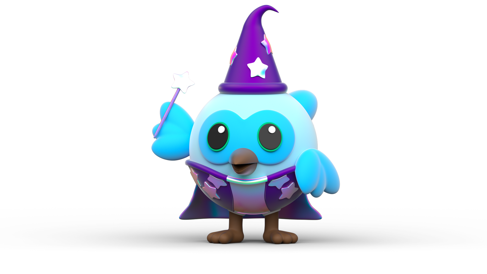

## Hi there, It's Ece ✌🏻

### About Me

- 🏢 I'm currently working on **Flutter, Dart**
- 🌱 I'm currently learning **HTML & CSS, Blender**
- 👯 I’m looking to collaborate for **Cross-Platform Projects**
- 📫 Reach me: **[LinkedIn][1]**
- 😄 Pronouns: Ec the Witch
- ⚡️ Fun fact: I'm a huge fan of Harry Potter 
"_F*ck realism I want magic!_" 🔮🪄

### Languages and Tools

#### Languages

     

#### Design

    

#### Others

    

#### My Github Stats:

[1]: https://www.linkedin.com/in/ecedzdmrr/